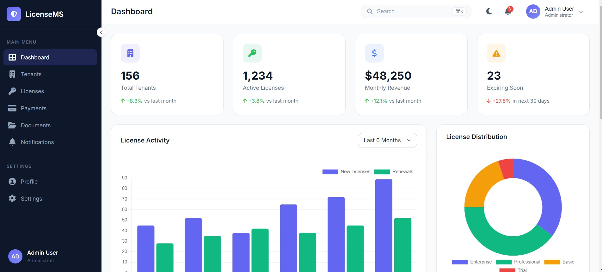
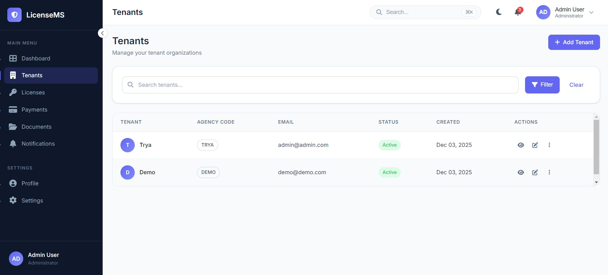

# License Management System

A comprehensive microservices-based application for managing professional licenses across multiple government agencies. Built with .NET 9, this system provides a scalable, secure, and maintainable solution for license application workflows, payments, document management, and notifications.

## 📸 Screenshots

<p align="center">
  
</p>

<p align="center">
  
</p>

<p align="center">
  
</p>
---
## 🎯 Project Overview

---

## ⚡ Quick Start

Follow these steps to start all services locally using the `.NET Aspire` AppHost. This is the fastest way to run the full system for development and testing.

1. Ensure prerequisites are installed (see the Prerequisites section).
2. From the repository root run:

```powershell
cd AppHost
dotnet run
```

This command boots the Aspire AppHost and starts every microservice and the Web UI with their configured ports. Expect the host to open the Aspire dashboard for service monitoring.

Service URLs (local):
- Web App: http://localhost:5000  (HTTPS: https://localhost:7000)
- Aspire Dashboard: http://localhost:15000
- Tenant Service API: http://localhost:5002  (HTTPS: https://localhost:7002)
- License Service API: http://localhost:5003  (HTTPS: https://localhost:7003)
- Document Service API: http://localhost:5004  (HTTPS: https://localhost:7004)
- Notification Service API: http://localhost:5005  (HTTPS: https://localhost:7005)
- Payment Service API: http://localhost:5006  (HTTPS: https://localhost:7006)

Tip: To build Docker images of each service using Aspire, see the Deployment section.

Note: The services that are tenant-aware (i.e., implement tenant-scoped data and behavior) are **License**, **Notification**, and **Document** services. The `TenantService` stores tenant metadata (profiles, configuration and connection information) used by these services.


## 🎯 Project Overview

This system is designed to handle professional license management for government agencies, supporting:

- **Multi-tenancy**: Each government agency operates in an isolated environment with its own data
- **Role-based Access**: Role-based dashboards and permissions for `TenantAdmin`, `Admin`, and `User`
- **Complete License Lifecycle**: From application submission to approval, renewal, and expiration
- **Document Management**: Secure upload and storage of supporting documents
- **Payment Processing**: Handle license fees and payment tracking
- **Notifications**: Email and in-app notifications for status updates

> *Note: Tenant and License services expose working REST APIs. The Web dashboard is not fully end-to-end and uses mostly static/sample data; other services also provide mainly static/sample data for demo purposes. That said, most microservices include REST endpoints implementing common CRUD operations and typical use cases — check each service's `*Service.Api` folder for available routes and examples.*

---

## 🏗️ Architecture

The application follows a **Clean Architecture** pattern with **CQRS (Command Query Responsibility Segregation)** for handling license application workflows.

### High-Level Architecture

```
┌─────────────────────────────────────────────────────────────────────────────┐
│                              ASP.NET MVC Frontend                           │
│                         (Role-based Dashboards)                             │
│                              Port: 5000/7000                                │
└─────────────────────────────────────────────────────────────────────────────┘
                                      │
                                      ▼
┌─────────────────────────────────────────────────────────────────────────────┐
│                           .NET Aspire AppHost                               │
│                    (Service Orchestration & Discovery)                      │
└─────────────────────────────────────────────────────────────────────────────┘
                                      │
        ┌─────────────┬───────────────┼───────────────┬─────────────┐
        ▼             ▼               ▼               ▼             ▼
┌─────────────┐ ┌─────────────┐ ┌─────────────┐ ┌─────────────┐ ┌─────────────┐
│   Tenant    │ │   License   │ │  Document   │ │Notification │ │   Payment   │
│   Service   │ │   Service   │ │   Service   │ │   Service   │ │   Service   │
│  Port:5002/7002  │ │  Port:5003/7003  │ │  Port:5004/7004  │ │  Port:5005/7005  │ │  Port:5006/7006  │
└─────────────┘ └─────────────┘ └─────────────┘ └─────────────┘ └─────────────┘
        │             │               │               │             │
        └─────────────┴───────────────┴───────────────┴─────────────┘
                                      │
                                      ▼
                    ┌─────────────────────────────────┐
                    │     PostgreSQL (Multi-Tenant)   │
                    │         + Redis Cache           │
                    └─────────────────────────────────┘
```

### Microservices

| Service | Port | Description |
|---------|------|-------------|
| **Tenant Service** | 5002 | Manages tenants (agencies), users, authentication, and authorization |
| **License Service** | 5003 | Handles license types, applications, approvals, and renewals |
| **Document Service** | 5004 | Manages document uploads, storage, and retrieval |
| **Notification Service** | 5005 | Sends email and in-app notifications |
| **Payment Service** | 5006 | Processes payments and tracks transactions |
| **Web App (MVC)** | 5000 | Frontend with role-based dashboards |

---

## 📁 Project Structure

```
LicenseManagementSystem/
├── AppHost/                          # .NET Aspire Host - Service Orchestration
│   ├── Program.cs                    # Service registration and configuration
│   └── appsettings.json              # Centralized configuration
│
├── src/
│   ├── Common/                       # Shared Libraries
│   │   ├── Common.Application/       # Shared application logic
│   │   │   ├── Authentication/       # Auth abstractions
│   │   │   ├── Interfaces/           # Common interfaces
│   │   │   └── Result/               # Result pattern implementation
│   │   │
│   │   ├── Common.Domain/            # Shared domain models
│   │   │   ├── Abstractions/         # Base entities, aggregates
│   │   │   ├── Constants/            # System-wide constants
│   │   │   ├── Events/               # Domain events
│   │   │   └── GlobalUser/           # User context
│   │   │
│   │   ├── Common.Infrastructure/    # Shared infrastructure
│   │   │   ├── Authentication/       # JWT token generation, password hashing
│   │   │   ├── Messaging/            # Event bus, message handling
│   │   │   ├── Migration/            # Database migration utilities
│   │   │   └── MultiTenancy/         # Multi-tenant database isolation
│   │   │
│   │   └── Common.Presentation/      # Shared API utilities
│   │
│   ├── Services/                     # Microservices
│   │   ├── TenantService/            # User & Agency Management
│   │   │   ├── TenantService.Api/            # REST API endpoints
│   │   │   ├── TenantService.Application/    # CQRS handlers
│   │   │   ├── TenantService.Domain/         # Domain entities
│   │   │   ├── TenantService.Infrastructure/ # External services
│   │   │   ├── TenantService.Persistence/    # EF Core, repositories
│   │   │   ├── TenantService.Contracts/      # DTOs, contracts
│   │   │   └── TenantService.Tests/          # Unit tests
│   │   │
│   │   ├── LicenseService/           # License Management (CQRS Pattern)
│   │   │   ├── LicenseService.Api/
│   │   │   ├── LicenseService.Application/
│   │   │   │   ├── Licenses/
│   │   │   │   │   ├── Commands/     # Create, Update, Delete operations
│   │   │   │   │   └── Queries/      # Read operations
│   │   │   │   ├── LicenseTypes/     # License type management
│   │   │   │   ├── LicenseDocuments/ # Document associations
│   │   │   │   └── Renewals/         # Renewal workflow
│   │   │   │       ├── Commands/     # Process renewals
│   │   │   │       └── Queries/      # Query renewals
│   │   │   ├── LicenseService.Domain/
│   │   │   ├── LicenseService.Infrastructure/
│   │   │   ├── LicenseService.Persistence/
│   │   │   ├── LicenseService.Contracts/
│   │   │   └── LicenseService.Tests/
│   │   │       ├── Application/      # Unit tests for handlers
│   │   │       └── Architecture/     # Architecture tests
│   │   │
│   │   ├── DocumentService/          # Document Management
│   │   │   ├── DocumentService.Api/
│   │   │   ├── DocumentService.Application/
│   │   │   │   └── Documents/        # Upload, download, delete
│   │   │   ├── DocumentService.Domain/
│   │   │   ├── DocumentService.Infrastructure/
│   │   │   ├── DocumentService.Persistence/
│   │   │   ├── DocumentService.Contracts/
│   │   │   └── DocumentService.Tests/
│   │   │
│   │   ├── NotificationService/      # Notification Management
│   │   │   ├── NotificationService.Api/
│   │   │   ├── NotificationService.Application/
│   │   │   │   ├── Notifications/    # Send, mark read, delete
│   │   │   │   └── Templates/        # Email templates
│   │   │   ├── NotificationService.Domain/
│   │   │   ├── NotificationService.Infrastructure/
│   │   │   ├── NotificationService.Persistence/
│   │   │   ├── NotificationService.Contracts/
│   │   │   └── NotificationService.Tests/
│   │   │
│   │   └── PaymentService/           # Payment Processing
│   │       ├── PaymentService.Api/
│   │       ├── PaymentService.Application/
│   │       ├── PaymentService.Domain/
│   │       ├── PaymentService.Infrastructure/
│   │       ├── PaymentService.Persistence/
│   │       ├── PaymentService.Contracts/
│   │       └── PaymentService.Tests/
│   │
│   └── Web/                          # ASP.NET MVC Frontend
│       ├── Controllers/              # MVC Controllers
│       │   ├── AccountController.cs      # Login, logout, register
│       │   ├── DashboardController.cs    # Role-based dashboards
│       │   ├── LicensesController.cs     # License CRUD
│       │   ├── DocumentsController.cs    # Document management
│       │   ├── PaymentsController.cs     # Payment processing
│       │   ├── NotificationsController.cs
│       │   └── TenantsController.cs      # Agency management
│       ├── Views/                    # Razor Views
│       ├── Services/                 # API client services
│       ├── ViewModels/               # View models
│       └── wwwroot/                  # Static assets
│
└── doc/                              # Documentation & Screenshots
```

---

## 🔑 Key Features

### 1. Multi-Tenancy
- **License Service**, **Document Service**, and **Notification Service** are tenant-aware
- Tenant context is resolved via JWT claims and propagated across these services
- Each agency can configure their own license types and workflows
 - When a new tenant is registered, the `TenantService` raises a domain event. That event is published (via Redis/pub-sub) and consumed by tenant-aware services; subscribers then create an isolated tenant database/schema and apply EF Core migrations automatically to bring the tenant store up to date.
 - The tenant id is read from the authenticated user's JWT claims (e.g. `tenant_id`) and used at runtime to load tenant-specific configuration (connection string, feature flags, workflows) from the `TenantService` metadata.

### 2. CQRS Pattern
All microservices follow the CQRS pattern to separate write (commands) and read (queries) concerns. Handlers live in each service's `*.Application` project so workflows remain testable and focused.

Example command/query naming conventions (apply per aggregate/entity):
```
Commands (Write Operations)                Queries (Read Operations)
├── Create{Aggregate}Command                 ├── Get{Aggregate}ByIdQuery
├── Update{Aggregate}Command                 ├── GetAll{Aggregate}Query
├── Delete{Aggregate}Command                 ├── Get{Aggregate}ByStatusQuery
├── Approve{Aggregate}Command                ├── GetExpiring{Aggregate}Query
└── Process{Aggregate}Command                 └── Search{Aggregate}Query
```

Concrete examples: `CreateLicenseCommand` / `GetLicenseByIdQuery`, `CreateDocumentCommand` / `GetDocumentByIdQuery`, `CreateNotificationCommand` / `GetNotificationsQuery`.

### 3. Authentication & Authorization
- **JWT-based authentication** across all microservices
- Role-based access control (`TenantAdmin`, `Admin`, `User`)
- Centralized token generation and validation

### 4. RESTful APIs
Each microservice exposes RESTful endpoints:
```
GET    /api/licenses              # List all licenses
POST   /api/licenses              # Create new license application
GET    /api/licenses/{id}         # Get license details
PUT    /api/licenses/{id}         # Update license
DELETE /api/licenses/{id}         # Delete license
POST   /api/licenses/{id}/approve # Approve license
POST   /api/licenses/{id}/renew   # Initiate renewal
```

### 5. Background Jobs

The License Service includes a background job for processing license renewals automatically.

#### License Renewal Background Job

A `BackgroundService` runs periodically to process pending license renewals. It is configured via `appsettings.json`:

```json
{
  "LicenseRenewalJob": {
    "Enabled": true,
    "IntervalMinutes": 60,
    "InitialDelaySeconds": 30
  }
}
```

| Setting | Description | Default |
|---------|-------------|---------|
| `Enabled` | Enable/disable the background job | `true` |
| `IntervalMinutes` | Interval between processing runs | `60` |
| `InitialDelaySeconds` | Delay before first run after startup | `30` |

> ⚠️ **Note**: The current implementation of the background job runs against the **main database only** and does **not iterate through individual tenant databases**. This means it will not process renewals for tenant-specific data as intended in a multi-tenant environment. To fully support multi-tenancy, the job would need to:
> 1. Retrieve the list of active tenants from the `TenantService`
> 2. For each tenant, establish a connection to their isolated database
> 3. Process pending renewals within that tenant's context

---

## 🛠️ Technology Stack

| Component | Technology |
|-----------|------------|
| **Framework** | .NET 9 |
| **Orchestration** | .NET Aspire |
| **Web Frontend** | ASP.NET Core MVC |
| **API** | ASP.NET Core Web API |
| **Database** | PostgreSQL |
| **Caching** | Redis |
| **ORM** | Entity Framework Core |
| **Authentication** | JWT Bearer Tokens |
| **Architecture** | Clean Architecture, CQRS |
| **Testing** | xUnit, Architecture Tests |

---

## 🚀 Getting Started

### Prerequisites

- [.NET 9 SDK](https://dotnet.microsoft.com/download/dotnet/9.0)
- [PostgreSQL](https://www.postgresql.org/download/) (or run `postgres` via Docker)
- [Redis](https://redis.io/download) (optional, for caching)
- [Visual Studio 2022](https://visualstudio.microsoft.com/) or [VS Code](https://code.visualstudio.com/)

### Configuration

1. **Clone the repository**
   ```bash
   git clone https://github.com/SkyThonk/LicenseManagementSystem.git
   cd LicenseManagementSystem
   ```

2. **Update connection strings** in `AppHost/appsettings.json`:
   ```json
   {
     "TenantService": {
      "ConnectionStrings": {
        "Default": "Host=localhost;Port=5432;Database=TenantService;Username=postgres;Password=yourpassword;Pooling=true;"
      }
     },
     "LicenseService": {
      "ConnectionStrings": {
        "Default": "Host=localhost;Port=5432;Database=LicenseService;Username=postgres;Password=yourpassword;Pooling=true;"
      }
     }
     // ... other services
   }
   ```

3. **Configure JWT settings**:
   ```json
   {
     "JwtSettings": {
       "Secret": "your-256-bit-secret-key-here-minimum-32-chars",
       "ExpiryMinutes": "60",
       "Issuer": "LicenseManagementSystem",
       "Audience": "LicenseManagementSystem"
     }
   }
   ```

### Running Tests

```bash
# Run all tests
dotnet test

# Run specific service tests
dotnet test src/Services/LicenseService/LicenseService.Tests
```

---

## 📐 Design Rationale

### Why Microservices?
- **Scalability**: Each service can be scaled independently based on load
- **Maintainability**: Smaller codebases are easier to understand and modify
- **Technology Flexibility**: Services can use different technologies if needed
- **Fault Isolation**: Failure in one service doesn't bring down the entire system

### Why Clean Architecture?
- **Separation of Concerns**: Business logic is isolated from infrastructure
- **Testability**: Core business logic can be tested without external dependencies
- **Flexibility**: Easy to swap out databases, UI frameworks, or external services

### Why CQRS?
- **Optimized Read/Write**: Queries and commands can be optimized separately
- **Audit Trail**: All state changes are tracked through commands
- **Scalability**: Read and write sides can be scaled independently
- **Complex Workflows**: Perfect for license application approval workflows

### Why .NET Aspire?
- **Service Discovery**: Automatic service registration and discovery
- **Centralized Configuration**: Single place for all service settings
- **Observability**: Built-in telemetry, logging, and health checks
- **Developer Experience**: Easy local development with F5 debugging

---

**Clean Architecture & Design Patterns**

- **DDD (Domain-Driven Design)**: Each microservice represents a bounded context. Core business concepts (aggregates, entities, value objects, domain services) live in the `Domain` project and encapsulate business rules and invariants.

- **Repository + Unit of Work (UoW)**: Repository interfaces (defined in `Application` or `Contracts`) decouple domain logic from persistence. Concrete implementations and the UoW live in `Persistence`/`Infrastructure` where the EF Core `DbContext` coordinates transactions across repositories.

- **CQRS**: Commands (writes) and Queries (reads) are separated. Command handlers and query handlers live in `Application` so business workflows remain testable and focused.

- **Result Pattern**: All command and query handlers return a `Result<T>` type instead of throwing exceptions for expected failures. This provides explicit error handling, makes the API contract clearer, and allows callers to handle success/failure cases gracefully. Error types (e.g., `NotFoundError`, `ValidationError`) are part of the result, enabling consistent error responses across all endpoints.

- **Wolverine for Messaging**: The project uses **Wolverine** (instead of MediatR) for in-process messaging, durable messaging, and background processing. Wolverine handles command/query dispatch (if used in-process), message routing, and can integrate with durable transports and outbox patterns.

- **Domain Events & Dispatching**: Aggregates raise domain events which are dispatched by a domain event dispatcher. Handlers for domain events live in `Application` or `Infrastructure` depending on whether they trigger local side-effects or integration events.

- **Transactional Outbox (Persistence-friendly)**: The outbox pattern is implemented in `Persistence` so that state changes and outbound events are written in the same DB transaction. A durable Wolverine publisher or a background worker reads the outbox and publishes integration events to the chosen broker (RabbitMQ, SNS/SQS, Kafka, etc.).

- **Integration Events & Eventual Consistency**: Cross-service workflows use integration events. The system embraces eventual consistency and compensating actions when distributed transactions are not feasible.

- **Anti-Corruption Layer (Adapters)**: Adapters and external integration code live under `Infrastructure` to prevent external models from leaking into the domain.

- **Factories, Specifications, & Policies**: Complex creation logic, reusable query specifications, and business policies are expressed inside `Domain`/`Application` to keep controllers and infrastructure thin.

- **Testing & Architecture Rules**: Unit tests cover domain rules and application handlers. Architecture tests validate layer boundaries (for example: `Application` should not depend on `Infrastructure`).

- **Where patterns live (mapping to your microservice layout)**:
  - **`*.Api`**: Controllers, endpoints, request/response DTOs, minimal orchestration.
  - **`*.Application`**: Commands, Queries, Handlers, application DTOs, repository/UoW interfaces, and validators.
  - **`*.Domain`**: Aggregates, Entities, Value Objects, Domain Events, Domain Services, Policies.
  - **`*.Persistence` / `*.Infrastructure`**: EF Core `DbContext`, repository implementations, outbox table, Wolverine message transports/adapters, third-party clients.
  - **`*.Contracts`**: Shared DTOs and integration event contracts used across services.
  - **`*.Tests`**: Unit, integration, and architecture tests.

- **Anti-Corruption Layer (ACL) / Adapters**: External APIs, file stores, and third-party services are accessed through adapter/port interfaces defined in `Infrastructure` to avoid leaking external models into the domain.

- **Factories & Specifications**: Factories encapsulate complex creation logic; specifications centralize query criteria used by repositories for reuse and testability.

- **Outbox + Message Broker Adapters**: The outbox pattern is paired with adapters for RabbitMQ, AWS SNS/SQS, or Kafka so the same publishing logic can target different brokers.

- **Testing & Architecture Tests**: Business rules live in the domain and are covered by unit tests. Architecture tests validate layering rules (eg. `Application` must not reference `Infrastructure`).

- **Where patterns live (mapping to project layout)**:
  - **Api**: Controllers, request/response models, endpoint wiring.
  - **Application**: Commands, Queries, Handlers, DTOs, interfaces (repositories, UoW), and application-level validations.
  - **Domain**: Aggregates, Entities, Value Objects, Domain Events, Domain Services.
  - **Contracts**: Shared DTOs and integration event contracts used across services.
  - **Infrastructure/Persistence**: EF Core DbContexts, repository implementations, outbox table implementation, external adapters.

---

## ☁️ Deployment

### Docker Containerization

The application uses **.NET Aspire** to build Docker images for each microservice. You can generate container images and deploy them to any container orchestration platform:

```bash
# Build Docker images using Aspire
cd AppHost
dotnet publish --publisher container
```

Once the Docker images are built, you can deploy them to:
- **AWS ECS/EKS** - Container orchestration on AWS
- **Azure Container Apps** - Managed container platform
- **Kubernetes** - Any K8s cluster
- **Docker Compose** - Local or simple deployments


## 🧪 Testing

The project includes:

### Unit Tests
- Application layer tests (Commands, Queries, Handlers)
- Domain entity tests
- Service tests

### Architecture Tests
- Ensure Clean Architecture rules are followed
- Validate CQRS handler patterns
- Check repository implementations
- Verify domain isolation

```
LicenseService.Tests/
├── Application/
│   ├── LicenseTests.cs
│   ├── LicenseTypeTests.cs
│   ├── LicenseStatusHistoryTests.cs
│   └── RenewalTests.cs
└── Architecture/
    ├── ArchitectureTests.cs
    ├── CqrsHandlerArchitectureTests.cs
    ├── DomainArchitectureTests.cs
    └── RepositoryArchitectureTests.cs
```

---
